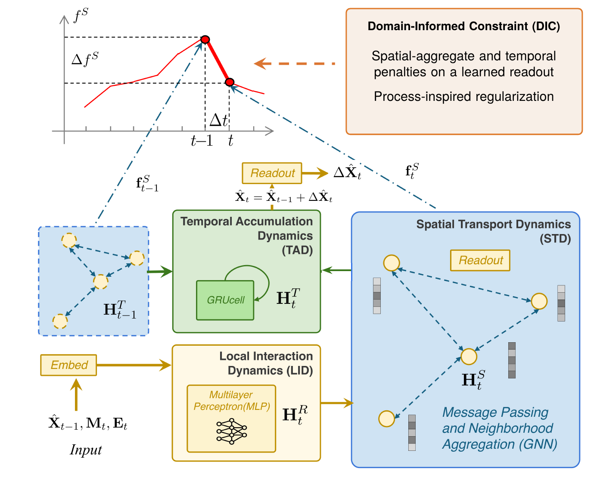

# PCDCNet

PCDCNet (Physical–Chemical Dynamics and Constraints Network) is a compact graph-recurrent network for station-level air-quality forecasting. It combines recent pollutant observations with meteorological covariates — and, where licensed, emission-inventory features — to produce hourly 72-hour forecasts of PM<sub>2.5</sub> and O<sub>3</sub> at monitoring stations.

This repository is the reference implementation accompanying the manuscript *Physics-informed graph-recurrent air-quality forecasting: emission-aware modelling and operational deployment*. An operational instance of the model serves free public forecasts on the Caiyun air-quality web map: **<https://caiyunapp.com/map/>**.

<p align="center">
  <a href="assets/architecture.png"></a>
</p>

## Model

Motivated by the process structure of chemical transport models, each hourly state update passes through three residual modules:

* **LID — Local Interaction Dynamics.** A two-layer SiLU MLP mixes the concentration state with the covariates at each station.
* **STD — Spatial Transport Dynamics.** Residual graph-convolution hops propagate information over a station graph whose edges connect stations within 200 km.
* **TAD — Temporal Accumulation Dynamics.** A gated recurrent cell carries memory across steps.

A shared linear readout predicts the concentration *increment*, so the forecast advances the previous concentration state step by step. With standardized inputs $\mathbf{M}_t$ (meteorology), $\mathbf{E}_t$ (optional emissions) and the previous concentration state $\bar{\mathbf{X}}_{t-1}$:

```math
\begin{aligned}
\mathbf{H}_t &= \mathrm{Linear}\big([\mathbf{M}_t,\ \mathbf{E}_t,\ \bar{\mathbf{X}}_{t-1}]\big) \\
\mathbf{H}_t &\leftarrow \mathbf{H}_t + \mathrm{LID}(\mathbf{H}_t) \\
\mathbf{H}_t &\leftarrow \mathbf{H}_t + \mathrm{STD}(\mathbf{H}_t;\ \hat{\mathbf{A}}),
\qquad \hat{\mathbf{A}} = \tilde{\mathbf{D}}^{-1/2}(\mathbf{A}+\mathbf{I})\tilde{\mathbf{D}}^{-1/2} \\
\mathbf{H}_t &\leftarrow \mathbf{H}_t + \mathrm{TAD}(\mathbf{H}_t,\ \mathbf{H}_{t-1}^{T}) \\
\hat{\mathbf{X}}_t &= \bar{\mathbf{X}}_{t-1} + \mathrm{Readout}(\mathbf{H}_t)
\end{aligned}
```

Training minimizes mean absolute prediction error over all forecast steps, stations and pollutant channels.

```text
Algorithm: PCDCNet forward pass
  H_T, X̂ ← HistoryWarmUp(X_hist, M_hist [, E_hist])   # same modules, observed X each step
  for t = 1 … 72:
      H ← Linear([M_t, E_t, X̂])
      H ← H + LID(H);  H ← H + STD(H, Â);  H_T ← TAD(H, H_T);  H ← H + H_T
      X̂ ← X̂ + Readout(H)
      store X̂
```

The released configuration has about 17 k parameters and supports CPU inference for a full regional station network.

## Installation

Python ≥ 3.11 with [uv](https://docs.astral.sh/uv/). Pick one PyTorch build:

```bash
uv sync --extra cpu     # CPU-only
uv sync --extra cu128   # CUDA 12.8 wheels
```

## Quickstart on the bundled sample

The repository ships a small sample — January 2017 of the BTHSA region (228 stations, 744 hours, ~3 MB) — so the full pipeline runs out of the box:

```bash
uv run python scripts/train.py --demo --max-epochs 8 \
    --dataset data/sample/knowair_v2_bthsa_2017-01.nc \
    --stations data/sample/stations_bthsa.csv \
    --output runs/demo
```

This trains on the first 70 % of the month's windows and scores the final 15 % — a pipeline demonstration, not a benchmark. Use the full dataset below for meaningful numbers.

## Data: KnowAir-V2

The full dataset is published on Zenodo under CC BY 4.0: **<https://doi.org/10.5281/zenodo.15614907>** (KnowAir-V2). It contains one NetCDF file and one station table per region:

| Region | Stations | File | Period |
| --- | --- | --- | --- |
| Beijing–Tianjin–Hebei surrounding area (BTHSA) | 228 | `dataset_bthsa.nc` | 2016-01-01 … 2023-12-31 |
| Yangtze River Delta (YRD) | 127 | `dataset_yrd.nc` | 2016-01-01 … 2023-12-31 |

Each file holds hourly `[time, station]` arrays: pollutants `PM2.5`, `O3` (µg/m³) and eight ERA5 meteorological channels (`t2m`, `d2m`, `sp`, `tp`, `blh`, `msdwswrf`, `u100`, `v100`). Download and verify checksums with:

```bash
uv run python scripts/download_data.py --output data/knowair_v2
```

## Reproduce the emission-free BTHSA training run

This from-scratch run produced the released [`checkpoints/bthsa/model.pt`](checkpoints/bthsa/model.pt) checkpoint, with a BTHSA O<sub>3</sub> test MAE of 16.70 µg/m³.

```bash
uv run python scripts/train.py \
    --dataset data/knowair_v2/dataset_bthsa.nc \
    --stations data/knowair_v2/stations_bthsa.csv \
    --output runs/bthsa \
    --history 24 --horizon 72 --hidden-size 32 \
    --learning-rate 1e-3 --weight-decay 1e-4 \
    --batch-size 32 --accumulate 4 \
    --max-epochs 200 --patience 10 --clip-norm 2.0 \
    --seed 42 --device cuda --num-workers 4
```

## Inference

Produce a forecast CSV from a checkpoint and the matching regional inputs:

```bash
uv run python scripts/predict.py \
    --checkpoint checkpoints/bthsa/model.pt \
    --dataset data/knowair_v2/dataset_bthsa.nc \
    --stations data/knowair_v2/stations_bthsa.csv \
    --init-time 2023-06-01T00:00 --output forecast.csv
```

`--init-time` is the first forecast valid time, one hour after issuance. Omit it to use the latest complete window in the file. The script needs pollutant observations only for the history and meteorological covariates for both history and the entire forecast horizon; future pollutant observations are not used. It writes `valid_time, station, PM2.5, O3` in µg/m³. KnowAir-V2 provides ERA5 reanalysis covariates, so this example is retrospective; a live forecast requires suitable issue-time meteorological forecasts.

## Repository scope

* The repository is self-contained: model, losses, graph construction, data pipeline, training, evaluation, sample data and trained checkpoints.
* Baseline/competitor implementations, the production serving stack and the historical experiment archives are not part of this release; the paper and its supplementary material document those evaluations and their caveats.

## Citation

If you use this code or KnowAir-V2, please cite the PCDCNet manuscript and the dataset:

```bibtex
@misc{knowairv2_dataset,
  author    = {Wang, Shuo and Cheng, Yun and Meng, Qingye and Saukh, Olga and
               Zhang, Jiang and Fan, Jingfang and Zhang, Yuanting and
               Yuan, Xingyuan and Thiele, Lothar},
  title     = {{KnowAir-V2}: A benchmark dataset for air quality forecasting
               with {PCDCNet}},
  year      = {2025},
  publisher = {Zenodo},
  doi       = {10.5281/zenodo.15614907},
}
```

A BibTeX entry for the paper will be added upon publication.

## License

Apache License 2.0; see [LICENSE](LICENSE). KnowAir-V2 is distributed separately under CC BY 4.0 via Zenodo; MEIC under its provider's terms.
